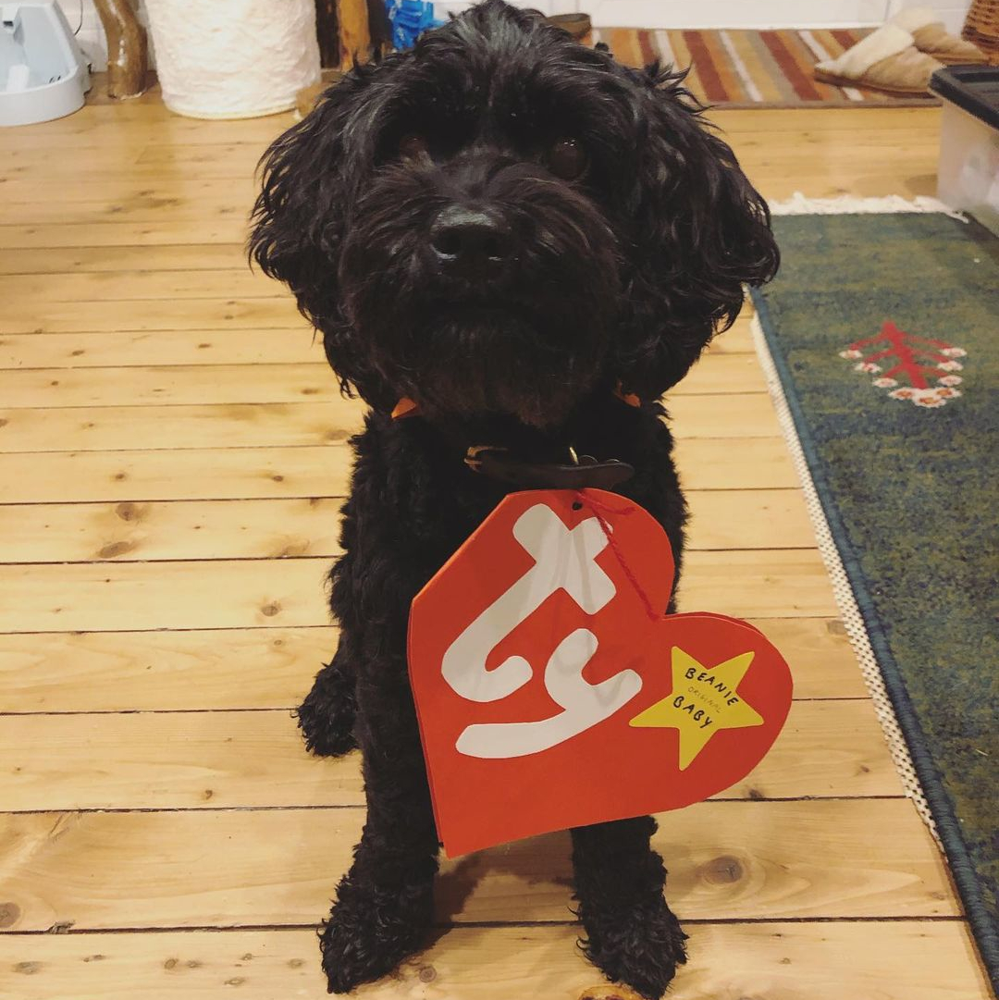
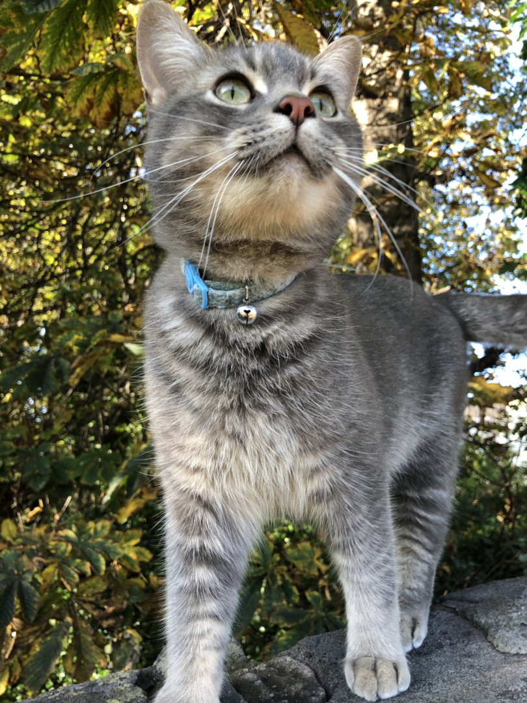
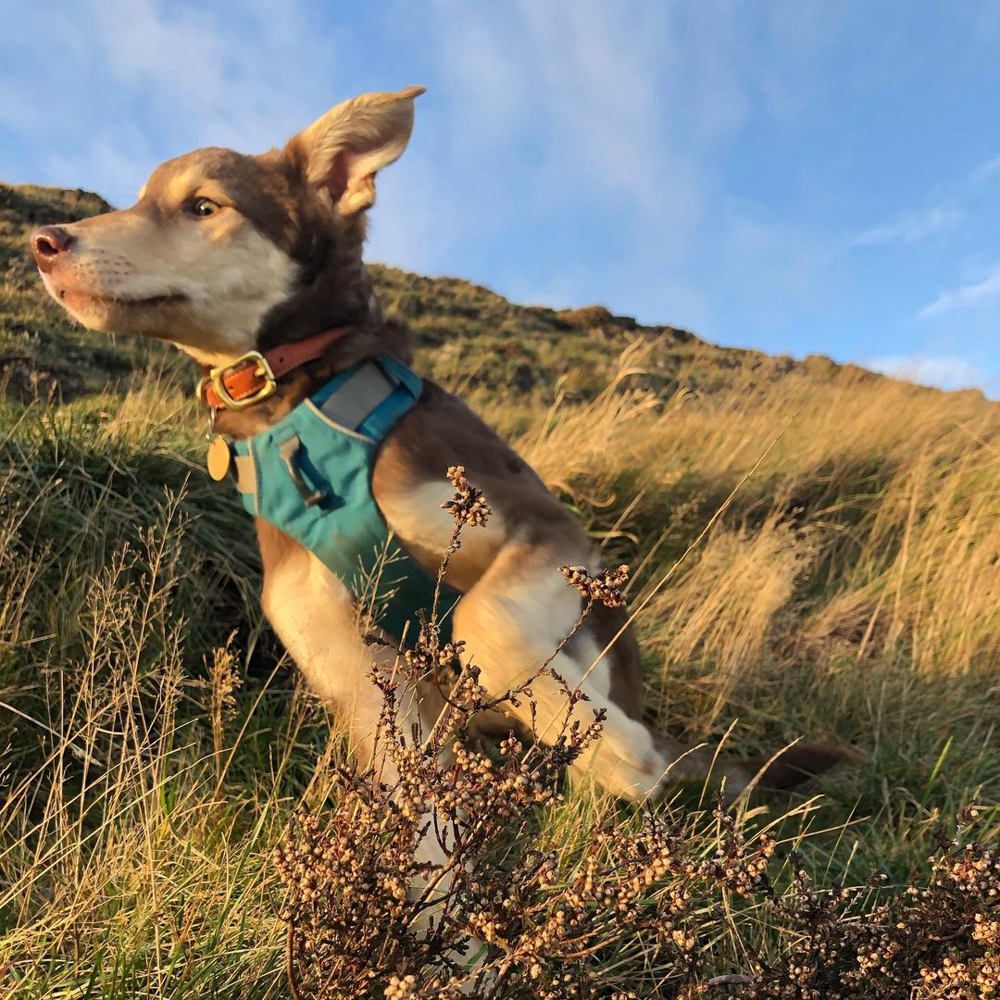

<head>

</head>
<body>

</body>

My name is Aneirin (Nye) Baker. I am a 3rd Year PhD student at Heriot Watt Univertisty under [Michael Hartmann](https://www.quantumtheory.nat.fau.eu/) (Erlangen Univeristy). Currently i am working with [Patrik Ohbergs group](http://home.eps.hw.ac.uk/~po15/index.html) as my local supervisor. My PhD is on Qunatum Computing Hardware looking into three body interactions within superconducting circuits and their uses in Quantum Simulators, in addition to this i work on Numerical Simulations of Chiral Condensates looking into their realtion to the Fractional Quantum Hall Effect. 

Outside of my PhD I love to cycle, i plan on doing Land's End to John o'Groates next Summer (2021) so training for that will begin as soon as the weather imporves in spring. I also love to Hike, Swim, Rock climb etc etc I love sports in general. In what spare time i have left I have three animals to look after two dogs (Kaya and Zuko) and a Cat (Loki), Zuko is the newest addition to our .....horde he's a 5 month Romanian rescue so he is taking alot of attention these days. 

<head>

</head>
<body>

  

    
    <figcaption>Kaya</figcaption>
  

  

        
    <figcaption>Loki</figcaption>
  

  

        
    <figcaption>Zuko</figcaption>
  

</body>

This website it partly a digital CV which i have been toying with the idea of making for a while, but mostly it's a place for me to slurge all of my hobbies and create a nice document of some of the things i do. It's not going to be somthing do all the time but i think it wil be a good way for me to learn some cool things about building websites, video/image editting. 
