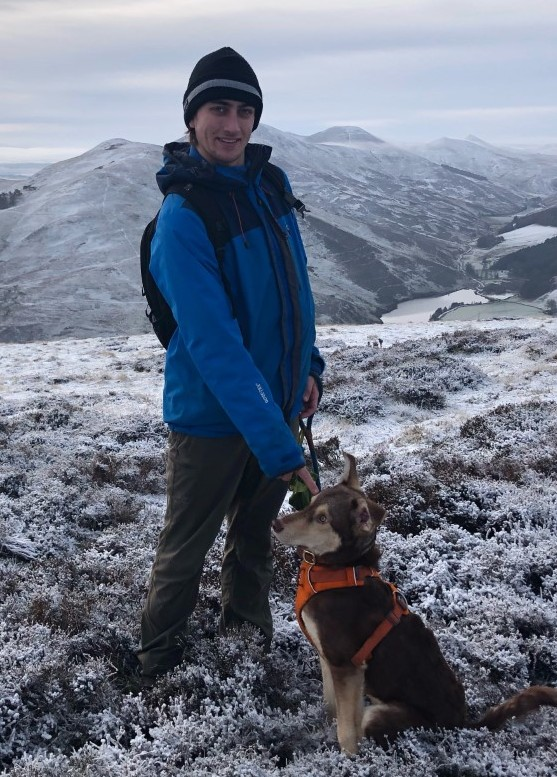
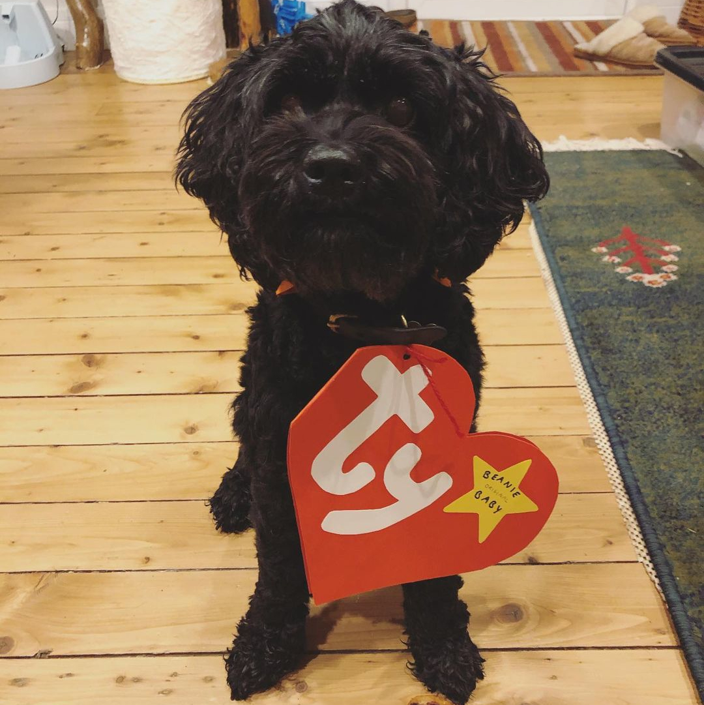
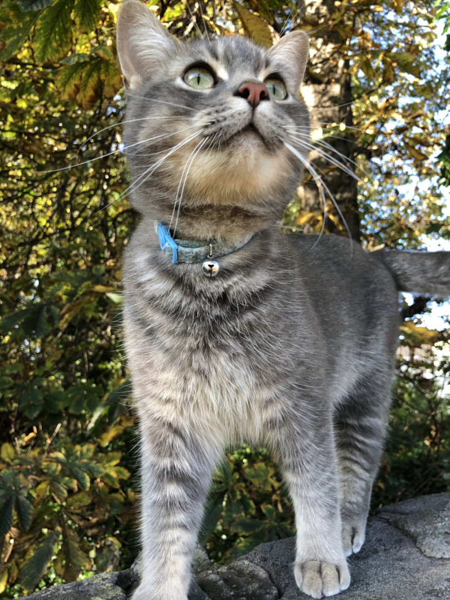
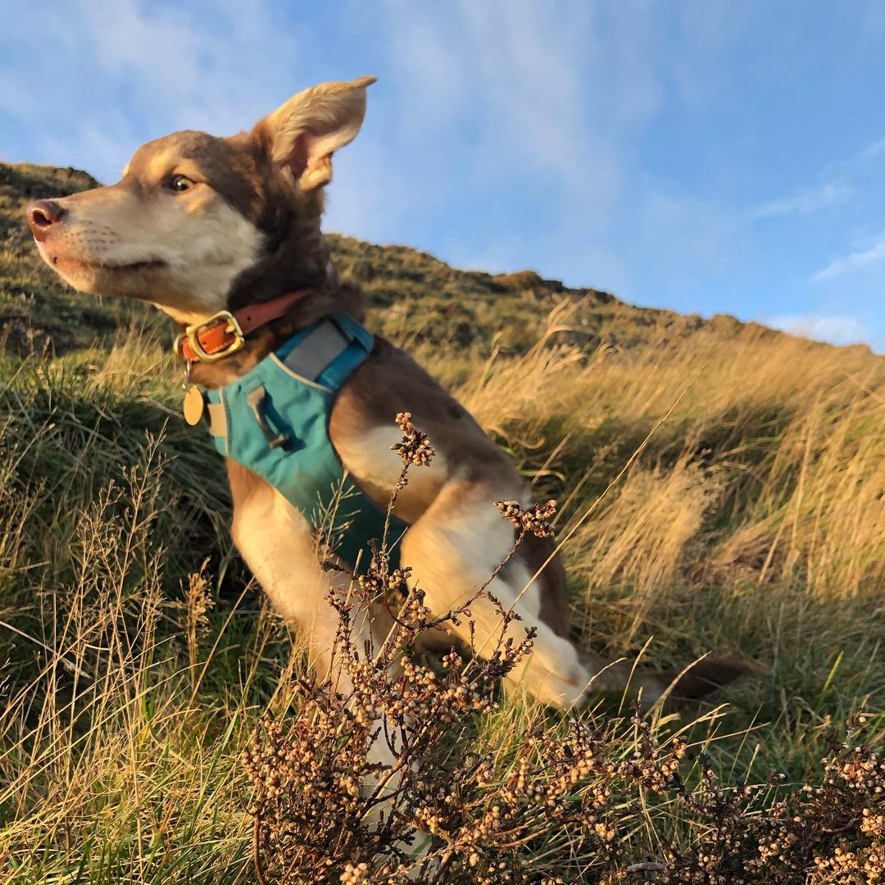

<head>

</head>
<body>

</body>

My name is Aneirin (Nye) Baker. I am a Hardware Engineer at the National Quantum Computing Center in the UK. I am just finishing up my PhD at Heriot Watt Univertisty studying under [Michael Hartmann](https://www.quantumtheory.nat.fau.eu/) (Erlangen Univeristy formerly Heriot Watt). Also working with [Patrik Ohbergs group](http://home.eps.hw.ac.uk/~po15/index.html). My PhD was on Qunatum Computing Hardware looking into three body interactions within superconducting circuits and their uses in Quantum Simulators. In addition to this I work on Numerical Simulations of Chiral Condensates looking into their relation to the Fractional Quantum Hall Effect. 

Outside of work I love to cycle, hike, swim, rock climb etc etc I love sports in general. In what spare time I have left I have three animals to look after; two dogs (Kaya and Zuko) and a Cat (Loki), Zuko is the newest addition to our .....horde he's a 2 year old Romanian rescue so he is taking alot of attention these days. 

<head>

</head>
<body>

  

    
    <figcaption>Kaya</figcaption>
  

  

        
    <figcaption>Loki</figcaption>
  

  

        
    <figcaption>Zuko</figcaption>
  

</body>

This website is partly a digital CV which I have been toying with the idea of making for a while, but mostly it's a place for me to splurge all of my hobbies and create a nice document of some of the things I do. It's not going to be something I do all the time but I think it wil be a good way for me to learn some cool things about building websites, video/image editing and Physics. 
