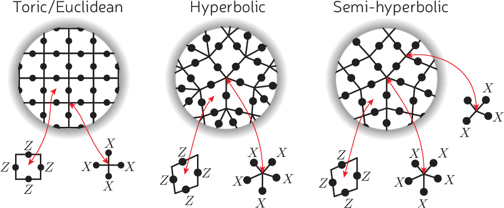

We aim to extend the ideas developed in our iToffoli work [1] to more general applications. We wish to apply the notion of controlled frequency shifts to parity measuremenets. In the stabalizer formalism of quantum error correction measuring parity if of central importance as it is used to determine weather an error has occured in the system and the state of the encoded logical qubit. 

In creating this method we again reduce a decompostion into two qubit gates to a single step (for small numbers of qubits). Whilst this method in priciple can be extended to an arbitary number of qubits the method shines in being able to multiply the parity measurements together to obatin a larger parity measurenet. This could have applications in error correcting schemes where the topology of the system isn't flat [2]. 

<table cellspacing="0" cellpadding="0" border="0">
  <td style="text-align: center;">
        
         
        <a>Different lattces that could be used for quantum error correction with this technique taken from [2].</a>
    </td>
</table>

### References

[1] - Aneirin J. Baker, Gerhard B. P. Huber, Niklas J. Glaser, Federico Roy, Ivan Tsitsilin, Stefan Filipp, and Michael J. Hartmann , "Single shot i-Toffoli gate in dispersively coupled superconducting qubits", Appl. Phys. Lett. 120, 054002 (2022) https://doi.org/10.1063/5.0077443

[2] - Breuckmann, Nikolas Peter et al. “Hyperbolic and semi-hyperbolic surface codes for quantum storage.” arXiv: Quantum Physics 2 (2017): 035007.

