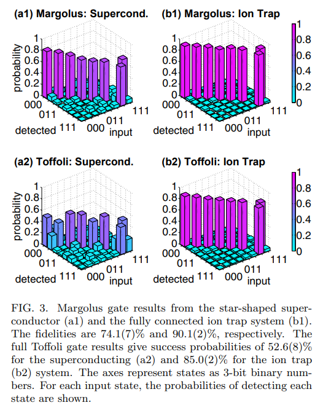
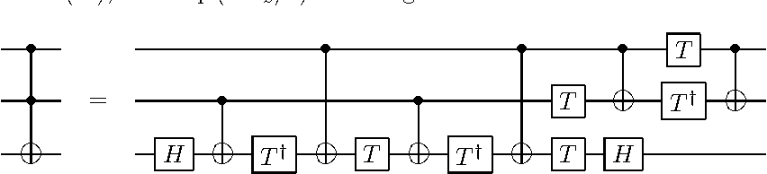

# Many Body Operations within Superconducting Circuits 

Quantum Superconducting circuits are a possibility for the basic archecture of Quantum Computers. Currently they exhibit 1 and 2 body interactions (with 4 a possibility bu not implemented). These types of Quantum Computers operator on a Gate based system where gates (operations) are applied to groups of Qubits to execute Qunatum algorithms.

Gates which apply to more than 2 Qubits are decomposed inot 1 & 2 gates to be executed. This effects the gate time and gate fidelity we aim to combat this by producing a circuit which can perform 1,2 and 3 body interactions. This would make Multi Body gates mich quicker and produce a higher Fidelity.

<table cellspacing="0" cellpadding="0" border="0">
        <td style="text-align: center;">
            
             
            <a >Toffoli gate executed on a SCC and an Ion Trap Quantum Computer (https://arxiv.org/abs/1702.01852)</a>
        </td>
</table>
As it can be seen above the Toffoli gate performed on the IBM Quantum Computer has a fidelity much lower than the Ion Trap QC which is to be expected. We aim to imporve on this by using a flux-qubit type element along with theoritical procedures developed in my PhD to perform this gate opertaion much quiker and with a higher fidelity. 
<table cellspacing="0" cellpadding="0" border="0">
	<td style="text-align: center;">
        
         
        <a>Toffoli decomposition into 1 and 2 body gates.</a>
    </td>
</table>
To do this we attempt to perform the gate in a single shot using the circuit we designed that can perform all interactions up to third order. This is exactly what you need for the decomposition of the Three qubit Toffoli gate however these interaction are very small as the interaction strength scales inversely to the number of qubits in the interaction. This here is where our challenge lies, we need to design a procedure where in we can make use of the small three body interaction without other interaction over powering them. 

