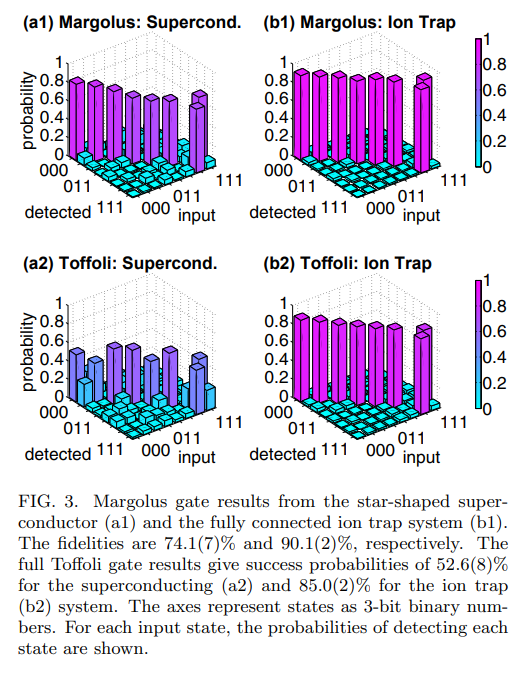

# Many Body Operations within Superconducting Circuits 

Quantum Superconducting circuits are a possibility for the basic archecture of Quantum Computers. Currently they exhibit 1 and 2 body interactions (with 4 a possibility bu not implemented CITE). These types of Quantum Computers operator on a Gate based system where gates (operations) are applied to groups of Qubits to execute Qunatum algorithms.

Gates which apply to more than 2 Qubits are decomposed inot 1 & 2 gates to be executed. This effects the gate time and gate fidelity we aim to combat this by producing a circuit which can perform 1,2 and 3 body interactions. This would make Multi Body gates mich quicker and produce a higher Fidelity.

<head>

</head>
<body>

</body>

